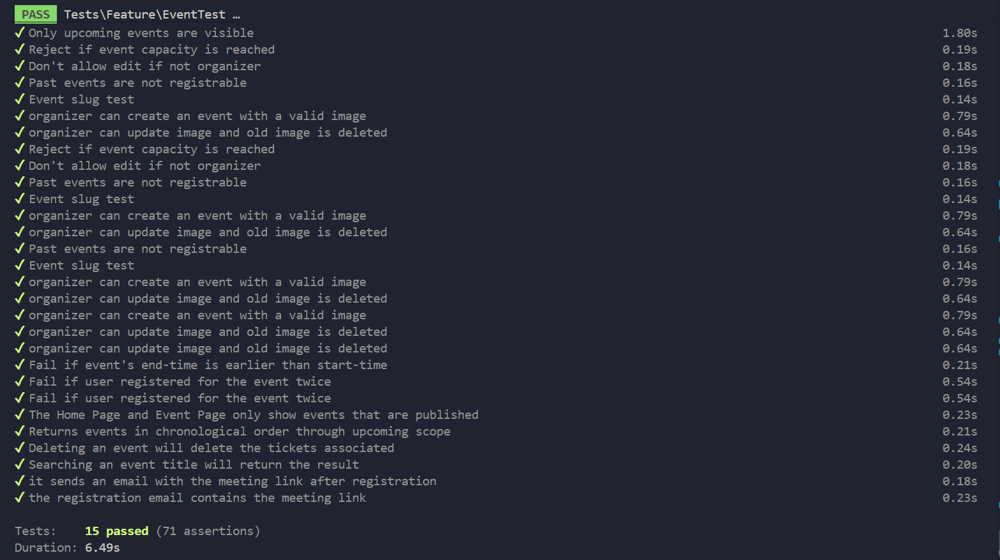
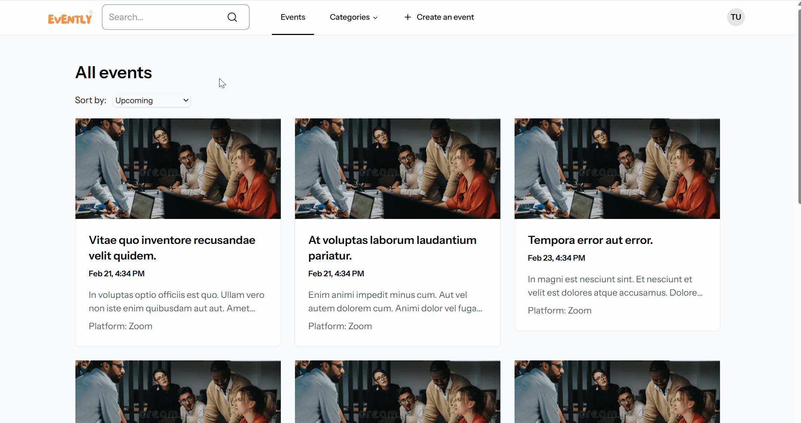
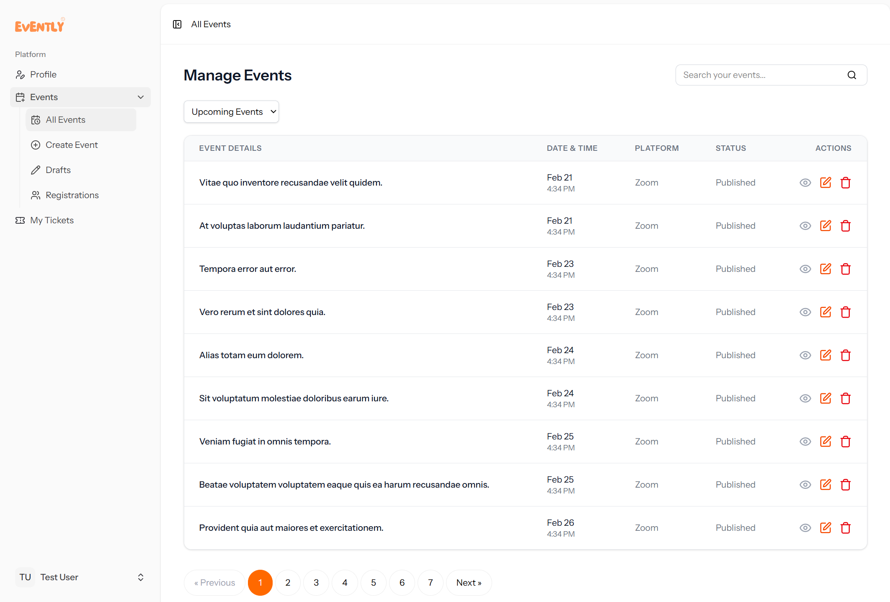
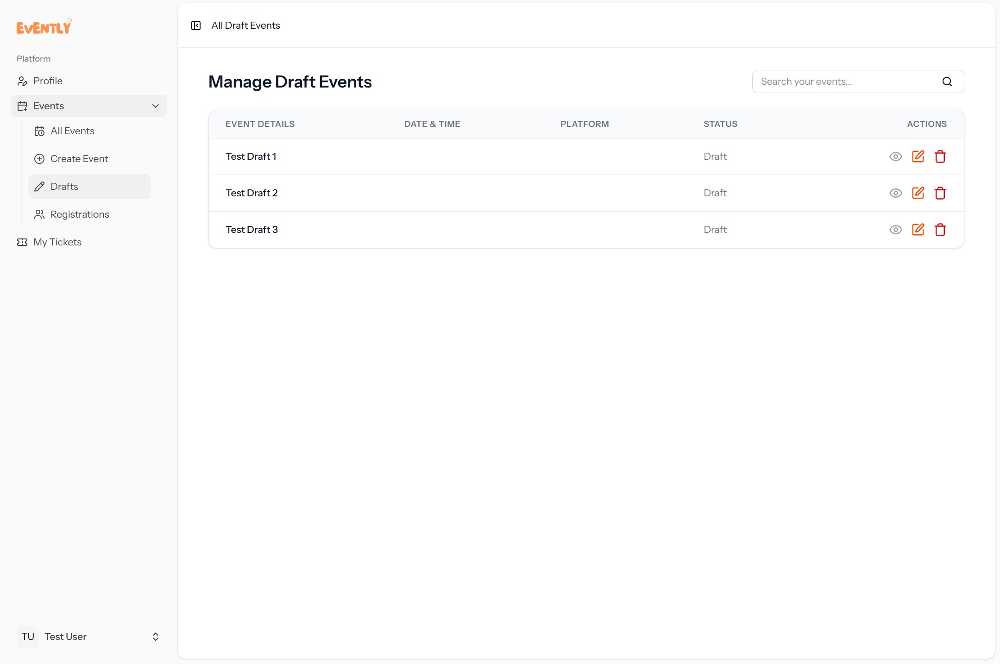
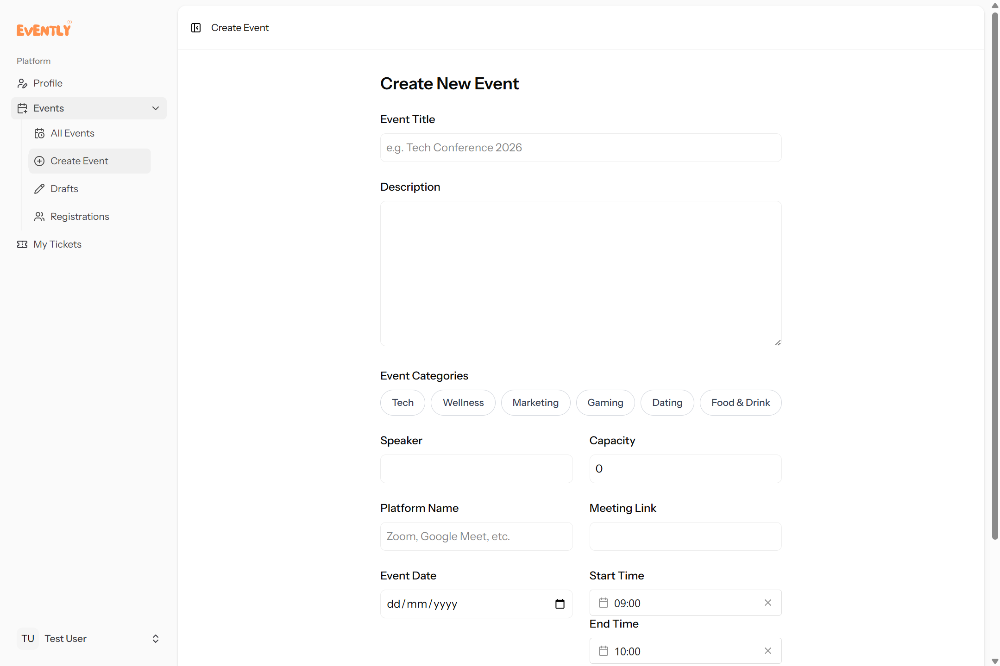
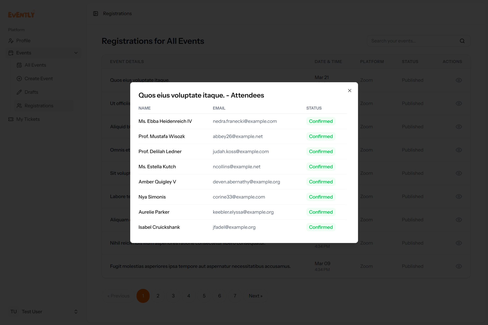
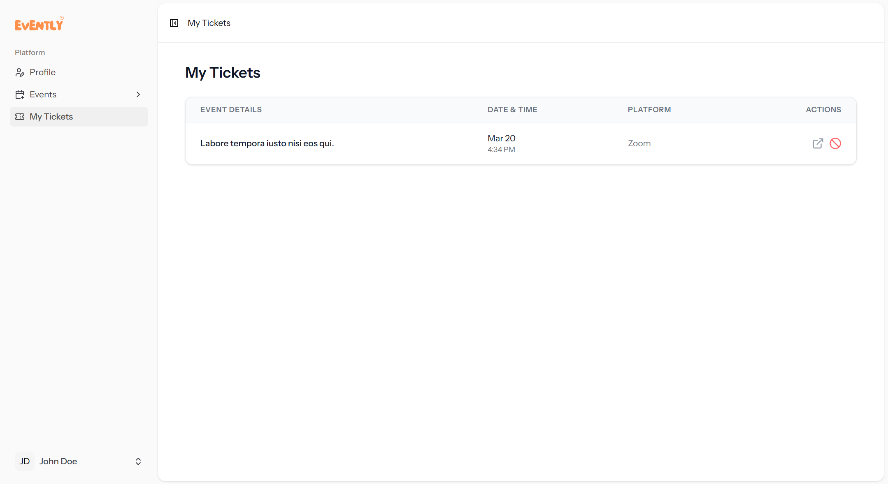
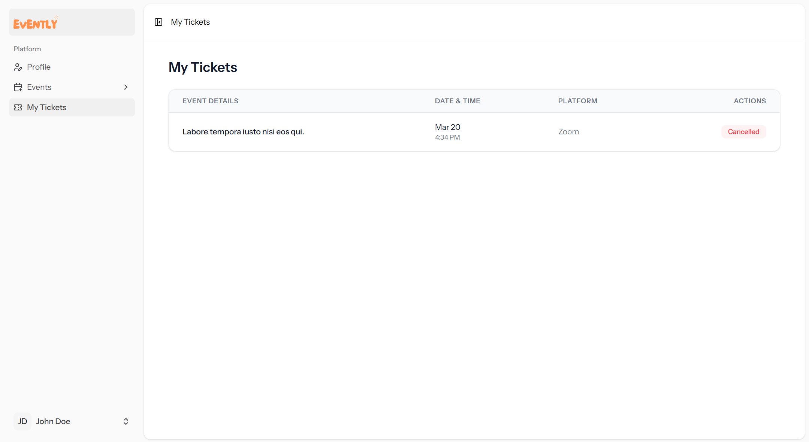
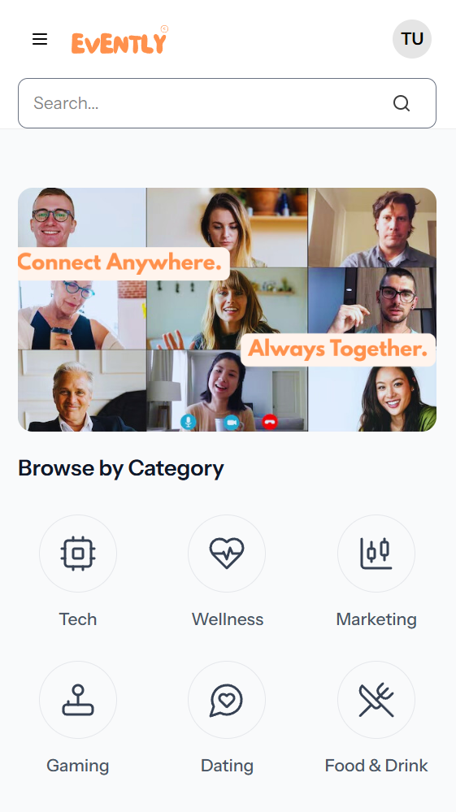

# Mini Online Event Platform (Laravel + Inertia.js)

A robust, production-ready Event Management platform built with Laravel 11, Inertia.js (Vue 3), and Tailwind CSS. This application handles the full lifecycle of event management, from draft creation to automated attendee registration and email notifications.

## Features

### Organizer Management

- Smart Validation: Distinct validation rules for Drafts vs. Published events.
- Automated Image Processing: Uses Intervention Image v3 to scale and convert uploads to WebP for optimized performance.
- Slug System: Automatically generates SEO-friendly URL slugs with unique suffixes.
- Authorization: Strict Policy-based access control (Users can only edit/delete their own events).
- Auto-Cleanup: Automatically deletes image files from storage when an event is deleted or the image is updated.

### Attendee Experience

- Live Search & Filtering: Real-time event filtering by title and category using Inertia query string synchronization.
- Atomic Registrations: Prevents overbooking using database-level checks and a custom isFull() model logic.
- Security: Unique database constraints prevent duplicate registrations for the same event.
- Cancellation: Allows users to cancel their attendance to the event.

### Communication & Performance

- Background Processing: Emails are sent via Queued Mailables, ensuring the UI remains instant and responsive.
- Meeting Delivery: Automatically emails the platform name and meeting link (Zoom, Google Meet, etc.) upon successful registration.
- N+1 Optimization: Uses withCount eager loading to handle capacity checks efficiently in list views.

## Tech Stack

- Backend: Laravel 11
- Frontend: Vue 3 via Inertia.js
- Styling: Tailwind CSS
- Image Handling: Intervention Image v3
- Testing: Pest PHP
- Database: MySQL

## Testing Suite

The event logic of the application was tested. Used Pest to ensure critical paths are bulletproof and logic is correct.

```bash
# Run the test suite
php artisan test tests/Feature/EventTest.php

```

What was tested:

- Feature: Event creation, editing, and deletion.
- Security: Middleware and Policy checks for unauthorized access.
- Logic: Capacity limits (the N+1 attendee problem).
- Storage: Assertion of file existence and deletion on the public disk.
- Mails: Mail::fake() assertions to verify meeting links are correctly included in outgoing emails.

### Test Results



## Installation

1. Clone and Install:

```bash
composer install
npm install

```

2. Environment Setup:

```bash
cp .env.example .env
php artisan key:generate
php artisan storage:link

```

3. Database & Seeding:

```bash
php artisan migrate --seed

```

4. Run Application:

```bash
composer run dev

```

---

## Key Learnings & Implementation Details

### Optimized Image Handling

I implemented **Intervention Image v3** to solve the problem of server storage bloat and slow page loads.

- **Scaling**: Standardized all banners to a 1200px width to ensure UI consistency.
- **Format Conversion**: Forced conversion to **WebP** with 75% quality, significantly reducing the storage footprint compared to standard JPEGs.
- **Cleanup**: Implemented logic to ensure that when an event is deleted or an image is updated, the old physical file is removed from the disk, preventing "ghost files" from accumulating.

### Data Privacy & Defensive Programming

- **Attribute Visibility**: Utilized Laravel's `$hidden` property on models to ensure sensitive data (like internal timestamps or private IDs) is never exposed to the frontend via Inertia props.
- **Policies**: Implemented Laravel Policies to handle authorization, ensuring a strict "owner-only" modification rule that is enforced at the controller level.
- **Atomic Integrity**: Used a unique composite key at the database level (`user_id` + `event_id`) to provide a fail-safe against race conditions, ensuring a user can never register for the same event twice.

### Database Performance

To keep the application fast as it scales:

- **N+1 Prevention**: Used `withCount()` to fetch ticket counts in a single query rather than running a new query for every event in the list.
- **Encapsulated Logic**: Created a dedicated `isFull()` model method to keep capacity checks consistent across the application.

---

### Selective Data Exposure (Security)

To protect private event data, I used a "Deny by Default" approach for sensitive attributes like `meeting_link`. These are defined in the Model's `$hidden` array and only exposed manually when specific authorization criteria are met.

**Model Definition:**

```php
protected $hidden = [
    'meeting_link', // Hidden by default from all users and guests
    'created_at',
    'updated_at',
];

```

**Controller Logic:**

```php
// Only expose the link if the user is the organizer or an attendee
if ($isOrganizer || $hasActiveTicket) {
    $event->makeVisible('meeting_link');
}

```

---

## Future Roadmap (To-Do)

While the core platform is fully functional, I plan to implement the following features to further enhance the ecosystem:

### Admin Dashboard

* **Global Overview**: A high-level view of all platform activity (total users, active events, revenue tracking).
* **Moderation Tools**: Ability for admins to flag, hide, or delete events that violate community guidelines.
* **Category Management**: An interface to create and manage the event categories available to organizers.

### Integrated Notifications

* **In-App Notification Center**: A dedicated UI for users to see registration confirmations and event updates without leaving the site.
* **Real-Time Updates**: Using **Laravel Reverb** or **Pusher** to notify organizers instantly when someone registers for their event.

---

## Application Screenshots

### Homepage


### Search and Filter Function



### Event Registration Function


### Manage Event Page



### Manage Draft Page



### Create Event Page



### View Event Registrations Page



### User Ticket Page



### User Ticket Page (Cancelled)



### Mobile View

